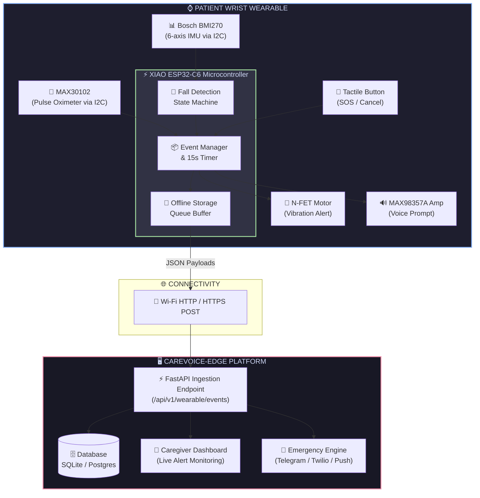
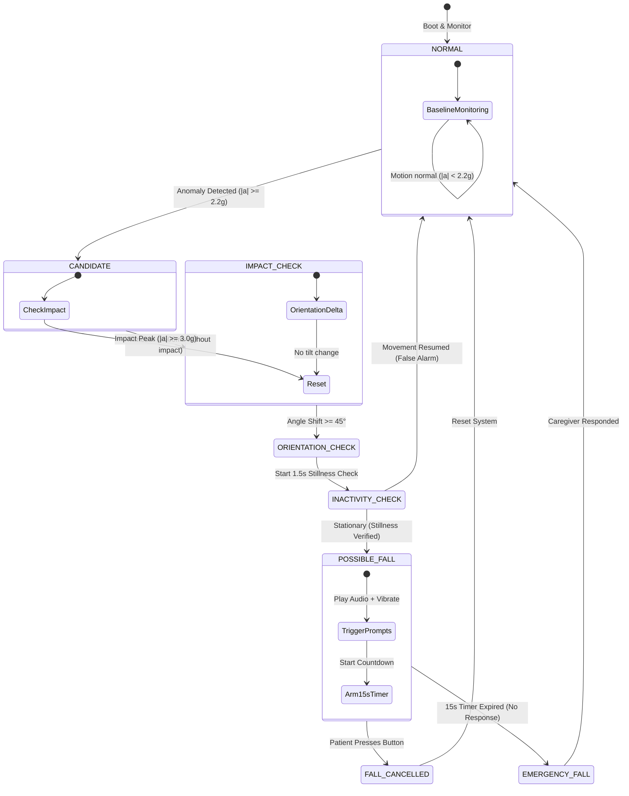

<h1 align="center">
  <br>
  
  <br>
  CareVoice Wearable
  <br>
</h1>

<h4 align="center">Wrist-Worn Patient Safety & Real-Time Edge Fall Detection System</h4>

<p align="center">
  <a href="#-system-architecture">
    
  </a>
  <a href="#-tech-stack">
    
  </a>
  <a href="#-backend-integration">
    
  </a>
  <a href="#-automated-tests">
    
  </a>
  <a href="LICENSE">
    
  </a>
</p>

<p align="center">
  <a href="#-key-features">Key Features</a> •
  <a href="#-system-architecture">System Architecture</a> •
  <a href="#-hardware-bom">Hardware BOM</a> •
  <a href="#-fall-detection-state-machine">Fall State Machine</a> •
  <a href="#-api-contract">API Contract</a> •
  <a href="#-installation--usage-guide">Installation</a>
</p>

---

## 🎯 Overview

**CareVoice Wearable** is a compact, intelligent wristband designed for elderly and home-care patient safety. Operating as an edge node for the **CareVoice-Edge** platform, it processes 6-axis motion dynamics locally on a **Seeed Studio XIAO ESP32-C6** microcontroller to detect candidate falls, prompt the patient via voice & haptic alerts, and manage emergency escalations automatically.

> 💡 **Edge Intelligence**: Sensor acquisition, 5-stage motion analysis, post-fall inactivity verification, 15-second response timers, and offline alert persistence are executed **100% on-device** to eliminate cloud latency and maintain protection during network drops.

---

## ✨ Key Features

| Feature | Icon | Description |
| :--- | :---: | :--- |
| **Multi-Stage Fall Detection** | 🚨 | 5-stage state machine combining acceleration magnitude, impact peak, orientation delta ($\Delta \theta$), and post-fall stillness. |
| **Patient Confirmation Window** | ⏱️ | 15-second local audio (`MAX98357A` speaker) + haptic (`vibration motor`) prompt window allowing patients to self-cancel false alarms. |
| **Automatic Emergency Escalation** | 🆘 | Unresponded falls trigger automatic `EMERGENCY_FALL` alerts to the CareVoice-Edge FastAPI server and caregiver notification engine. |
| **Immediate Manual SOS** | 🔴 | Instant physical button press during normal monitoring dispatches an immediate `SOS` emergency alert without delay. |
| **Heart Rate Monitoring** | 💓 | Periodic optical PPG pulse sampling via `MAX30102` sensor with telemetry reporting. |
| **Offline Buffer Queue** | 📴 | Stores emergency events in local Flash/RAM when Wi-Fi is lost and automatically flushes the queue upon network recovery. |

---

## 🏗️ System Architecture



---

## 🧩 Hardware BOM & Pinout

```text
                  +---------------------------------------+
                  |       SEEED STUDIO XIAO ESP32-C6      |
                  |                                       |
                  | [GPIO 22] --------> SDA  (I2C Bus)    |
                  | [GPIO 23] --------> SCL  (I2C Bus)    |
                  | [GPIO 16] --------> BCLK (I2S Audio)  |
                  | [GPIO 17] --------> LRCK (I2S Audio)  |
                  | [GPIO 18] --------> DOUT (I2S Audio)  |
                  | [GPIO 19] --------> GATE (MOSFET Motor)|
                  | [GPIO 20] --------> BTN  (Tactile SOS)|
                  | [GPIO 15] --------> LED  (Status)     |
                  +---------------------------------------+
```

| Component | Module Name | Protocol / Pin | Details |
| :--- | :--- | :---: | :--- |
| **MCU** | Seeed Studio XIAO ESP32-C6 | 3.3V System | 160MHz RISC-V CPU, Wi-Fi 6, BLE 5 |
| **Motion Sensor** | Bosch BMI270 | I2C (`0x68`) | 16-bit 6-axis IMU (Accel + Gyro) |
| **Heart Rate** | MAX30102 | I2C (`0x57`) | Optical PPG heart-rate pulse sensor |
| **Audio Amp** | MAX98357A | I2S | Digital Class-D amplifier driving 8Ω 1W speaker |
| **Haptic Motor** | 3V Coin Vibration | GPIO 19 (PWM) | Driven via AO3400A N-FET with 1N5819 diode |
| **Push Button** | Tactile Switch | GPIO 20 | Internal pull-up; active low interrupt |
| **Battery** | 3.7V Li-Po | Power Pins | Integrated XIAO battery charging management |

---

## 🔄 Fall Detection State Machine



---

## 📡 API Contract & JSON Payloads

The wearable POSTs canonical JSON event schemas to `/api/v1/wearable/events`:

### 1. 🚨 Candidate Fall Detected (`POSSIBLE_FALL`)
```json
{
  "device_id": "wearable_001",
  "patient_id": "patient_001",
  "event": "POSSIBLE_FALL",
  "fall_confidence": 0.88,
  "heart_rate": 84
}
```

### 2. ✅ Patient Self-Cancellation (`FALL_CANCELLED`)
```json
{
  "device_id": "wearable_001",
  "patient_id": "patient_001",
  "event": "FALL_CANCELLED",
  "reason": "PATIENT_RESPONDED"
}
```

### 3. 🆘 Unresponded Emergency Fall (`EMERGENCY_FALL`)
```json
{
  "device_id": "wearable_001",
  "patient_id": "patient_001",
  "event": "EMERGENCY_FALL",
  "reason": "NO_RESPONSE"
}
```

### 4. 🔴 Manual SOS Button Press (`SOS`)
```json
{
  "device_id": "wearable_001",
  "patient_id": "patient_001",
  "event": "SOS"
}
```

---

## 📂 Directory Structure

```text
CareVoice-Wearable/
├── 📂 firmware/
│   ├── 📂 config/
│   │   ├── config.h            # Central thresholds & parameters
│   │   └── pin_map.h           # ESP32-C6 GPIO allocations
│   ├── 📂 sensors/
│   │   ├── bmi270_driver.cpp   # 6-axis IMU sensor driver
│   │   └── max30102_driver.cpp # Heart rate PPG sensor driver
│   ├── 📂 interaction/
│   │   ├── button_handler.cpp  # Debounced button logic
│   │   ├── vibration_motor.cpp # N-FET haptic controller
│   │   └── audio_prompt.cpp    # I2S voice guidance driver
│   ├── 📂 fall_detection/
│   │   └── fall_state_machine.cpp # Multi-stage detection logic
│   ├── 📂 events/
│   │   └── event_manager.cpp   # Payload generator & 15s timer
│   ├── 📂 connectivity/
│   │   └── wifi_client.cpp     # HTTP POST networking client
│   ├── 📂 storage/
│   │   └── offline_queue.cpp   # Non-volatile offline retry queue
│   └── main.cpp                # Core application loop
├── 📂 backend/
│   └── mock_server.py          # FastAPI event ingestion service
├── 📂 tests/
│   ├── test_fall_detection.cpp # C++ state machine benchmarks
│   └── test_mock_server.py     # Pytest backend validation suite
├── .gitignore                  # Git exclusion policy
└── README.md                   # System documentation
```

---

## 🚀 Installation & Usage Guide

### 🛠️ Prerequisites

- **Python 3.10+**
- **Git**
- (Optional for Hardware) **PlatformIO IDE** or **VS Code** with ESP32 support

---

### 1️⃣ Run Backend Mock Server

Clone the repository and launch the FastAPI ingestion server:

```bash
# Clone the repository
git clone https://github.com/AreyMayank/CareVoice-Wearable.git
cd CareVoice-Wearable

# Install dependencies
pip install fastapi uvicorn pydantic pytest httpx

# Start FastAPI Event Server
python -m uvicorn backend.mock_server:app --reload --host 0.0.0.0 --port 8000
```

> 🌐 Interactive Swagger API docs will be live at: `http://localhost:8000/docs`

---

### 2️⃣ Build & Flash Firmware

1. Open `CareVoice-Wearable` directory in **PlatformIO**.
2. Configure Wi-Fi credentials in [`firmware/config/config.h`](file:///d:/Antigravity_files/fall_wrist/firmware/config/config.h).
3. Connect **Seeed Studio XIAO ESP32-C6** via USB-C.
4. Upload firmware:
   ```bash
   pio run --target upload
   ```

---

### 3️⃣ Run Automated Test Suite

Execute the `pytest` test suite to validate API contracts, event schema validation, and server state updates:

```bash
python -m pytest tests/test_mock_server.py
```

```text
======================== 7 passed in 0.66s =========================
```

---

## 📜 License

This project is open-source under the [MIT License](LICENSE).
